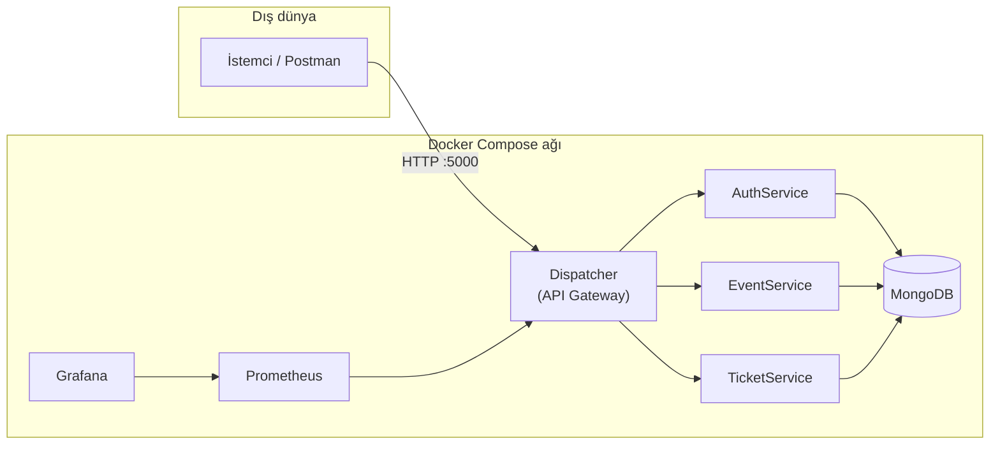
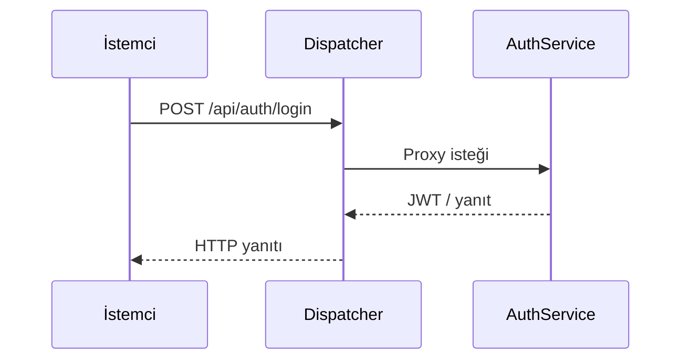
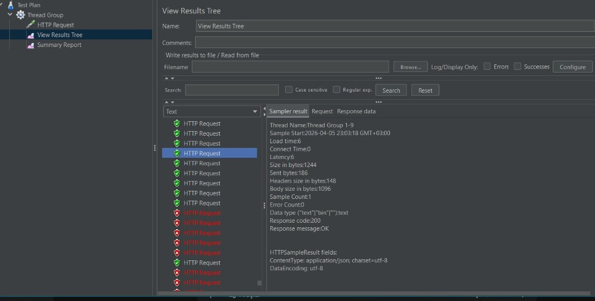
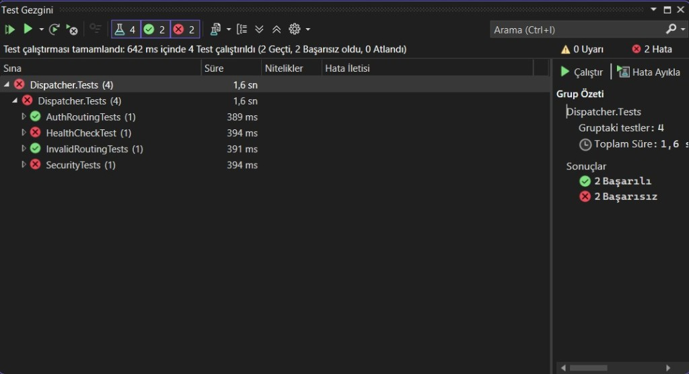
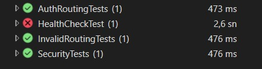

# Yazılım Geliştirme Laboratuvarı-II — Proje 1  
## Etkinlik ve Bilet Yönetimi — Mikroservis Mimarisi ve API Gateway

| | |
|---|---|
| **Ders** | Yazılım Geliştirme Laboratuvarı-II |
| **Proje** | Proje-1 |
| **Tarih** | 5 Nisan 2026 |

### Ekip üyeleri

| Ad Soyad | Öğrenci numarası |
|----------|------------------|
| Furkan Kerim Ocak | 231307030 |
| Cüneyt Şendur | 221307002 |

---

## 1. Giriş: problemin tanımı ve amaç

Modern web uygulamalarında tek bir monolit uygulama yerine, **bağımsız ölçeklenebilir servislerden** oluşan mimariler tercih edilmektedir. Bu proje, dış dünyaya tek giriş noktası sunan bir **Dispatcher (API Gateway)** ve bunun arkasında çalışan **kimlik doğrulama** ile **iş mantığı mikroservisleri** ile etkinlik ve bilet senaryosunu uçtan uca modellemeyi amaçlamaktadır.

**Amaçlar:**

- İsteklerin merkezi bir ağ geçidi üzerinden yönlendirilmesi  
- JSON tabanlı servisler arası iletişim  
- NoSQL (MongoDB) ile veri saklama ve servis bazında veri ayrımı  
- Docker ve `docker compose` ile tüm sistemin tek komutla ayağa kaldırılması  
- Dispatcher bileşeninde **Test-Driven Development (TDD)** disiplinine uyum  
- İzleme altyapısı (Prometheus metrikleri, Grafana) ile trafiğin gözlemlenebilirliği  

---

## 2. Kavramsal çerçeve

### 2.1 Mikroservis mimarisi

Mikroservis mimarisinde uygulama, **sınırları net** servislere bölünür; her servis kendi yaşam döngüsüne, veri deposuna ve dağıtımına sahip olabilir. Bu projede **Dispatcher**, **AuthService**, **EventService** ve **TicketService** birbirinden bağımsız üniteler olarak konumlandırılmıştır.

### 2.2 REST ve Richardson Olgunluk Modeli (RMM)

**REST**, kaynakların URI ile tanımlanması ve uygun **HTTP fiilleri** (GET, POST, PUT, DELETE) ile işlemlerin yapılması prensibine dayanır. **RMM Seviye 2**, kaynak tabanlı URI’ler ve doğru HTTP yöntemlerinin kullanımını öngörür. Projede örneğin kimlik işlemleri `POST /api/auth/register`, `POST /api/auth/login`; etkinlikler `GET/POST /api/events`; bilet işlemleri `POST /api/tickets/buy`, `GET /api/tickets/user/{userId}` gibi uçlarla modellenmiştir. Tam CRUD’un her kaynak için genişletilmesi (ör. etkinlik silme/güncelleme) gelecek çalışma olarak bırakılabilir.

### 2.3 API Gateway (Dispatcher)

**YARP (Yet Another Reverse Proxy)** kullanılarak gelen istekler URL yoluna göre ilgili kümeye yönlendirilir. Üretim ortamında Docker ağı üzerinden `authservice`, `eventservice`, `ticketservice` adreslerine proxy yapılır. Yerel geliştirme ve entegrasyon testleri için `appsettings.Development.json` ile farklı hedef adresleri kullanılabilir.

### 2.4 TDD (Red — Green — Refactor)

Dispatcher tarafında **xUnit** ve **Microsoft.AspNetCore.Mvc.Testing** ile entegrasyon testleri yazılmıştır. TDD yaklaşımı gereği testler, yönlendirme ve güvenlik beklentilerini kod öncesi veya eşzamanlı olarak tanımlamaya uygundur.

---

## 3. Sistem mimarisi ve modüller

### 3.1 Bileşen diyagramı (Mermaid)



### 3.2 İstek akışı (sequence — özet)



### 3.3 Modül özeti

| Modül | Görev | Teknoloji |
|-------|--------|-----------|
| **Dispatcher** | Yönlendirme, JWT doğrulama altyapısı, Prometheus metrikleri | ASP.NET Core 8, YARP |
| **AuthService** | Kayıt, giriş, JWT üretimi, kullanıcı verisi | ASP.NET Core 8, MongoDB |
| **EventService** | Etkinlik listeleme ve oluşturma | ASP.NET Core 8, MongoDB |
| **TicketService** | Bilet satın alma, kullanıcıya göre listeleme | ASP.NET Core 8, MongoDB |

---

## 4. Nesne yönelimli tasarım

Servisler **controller — repository — model** ayrımı ile yapılandırılmıştır. Veri erişimi arayüzler (`IUserRepository`, `IEventRepository`, `ITicketRepository`) üzerinden soyutlanmıştır. Bu yapı, **SOLID** prensiplerinden özellikle tek sorumluluk ve bağımlılığın tersine çevrilmesi (DIP) ile uyumludur.

---

## 5. Veri tabanı ve izolasyon

- **MongoDB** kullanılmaktadır; servisler farklı veritabanı adları ile (`AuthDb`, `EventDb`, `TicketDb`) mantıksal izolasyon sağlar.  
- JSON dosyası tabanlı sahte veri tabanı kullanılmamıştır.  
- Dispatcher’ın yetki/rol verisini ayrı bir NoSQL şemasında tutması ileri aşama iyileştirmesi olarak değerlendirilebilir.

---

## 6. Docker ve orkestrasyon

```bash
docker compose up --build
```

- **Dispatcher** dışarıya `5000` portundan açılır.  
- **Grafana** `3000`, **Prometheus** `9090` portlarından erişilebilir.  
- Mikroservisler varsayılan compose dosyasında host portu yayınlamadan iç ağda çalışır; dış erişim gateway üzerinden hedeflenir.

---

## 7. Testler ve TDD

### 7.1 Dispatcher testleri (özet)

- **Yönlendirme / geçersiz yol:** Tanımsız gateway yollarında beklenen HTTP durumları.  
- **Güvenlik:** Belirli gateway uçlarında kimlik doğrulama beklentisi.  
- **Kayıt akışı:** Gateway üzerinden kayıt isteğinin başarılı oluşturma (201) senaryosu; yerel ortamda Auth servisinin ayakta ve doğru portta olması gerekir.

Test projesi: `Dispatcher.Tests/Dispatcher.Tests/`

---

## 8. Yük testi ve performans (durum raporu)

Ders kapsamında **JMeter, Locust veya k6** ile yoğun trafik altında ölçüm ve sonuçların raporda tablo/grafik ile sunulması beklenmektedir.

**Mevcut durum:** Yük testi süreci **tamamlanamamıştır**; yalnızca dış kaynaklı öneri metinleri ile sınırlı kalınmış, **50 / 100 / 200 / 500 eş zamanlı istek** senaryolarına ait ölçülmüş **ortalama gecikme, hata oranı, RPS** değerleri ve Grafana üzerinde bu sonuçların gösterimi **henüz teslim edilecek düzeyde derlenmemiştir**.

**Önerilen tamamlama adımları (ek çalışma):**

1. `docker compose up` ile sistem ayağa kaldırıldıktan sonra hedef taban adres: `http://localhost:5000` (Dispatcher).  
2. k6, Locust veya JMeter ile `GET /api/events` ve uygun `POST` uçlarına aşamalı yük.  
3. Sonuç tablosu ve ekran görüntülerinin bu README veya ek PDF rapora eklenmesi.  
4. `prometheus.yml` içinde Dispatcher hedefinin Docker ortamı ile uyumlu olması (ör. `dispatcher:8080`) ve Grafana’da pano oluşturulması.

---

## 9. Ekran görüntüleri

Görseller `docs/screenshots/` klasöründedir.

### 9.1 Yük testi (Apache JMeter)

Dispatcher’a yönelik yük denemesi **JMeter** ile yapılmıştır. **View Results Tree** çıktısında ilk isteklerde başarılı (200 OK) yanıtlar görülürken, art arda gönderilen isteklerde hata (kırmızı) kayıtları oluşmuştur; bu da yoğun eşzamanlı trafik altında sistemin tamamlanmış bir performans raporu üretmeden önce sınırlandığını göstermektedir.



### 9.2 TDD — Red aşaması (Test Gezgini)

TDD döngüsünün **kırmızı** aşamasında Test Gezgini’nde dört testten ikisinin başarısız olduğu çalıştırma özeti (ör. yönlendirme/güvenlik/kayıt beklentileri henüz tam karşılanmadan).



### 9.3 TDD — Green aşaması

Aynı test paketinde **yeşil** aşamaya geçiş: çoğu senaryonun geçtiği, yalnızca kayıt (HealthCheck) senaryosunun ortam bağımlılığı nedeniyle (Auth servisinin yerelde ayakta olmaması vb.) hâlâ kırmızı kalabildiği bir koşum örneği.



---

## 10. Sonuç, başarılar ve sınırlılıklar

**Başarılar:**

- Dört bağımsız ünite (Dispatcher + Auth + iki iş mikroservisi) ve MongoDB ile uçtan uca senaryo  
- Docker Compose ile orkestrasyon  
- Gateway üzerinden yönlendirme ve JWT altyapısı  
- Dispatcher için otomatik test altyapısı ve TDD odaklı geliştirme  
- Prometheus ve Grafana konteynerleri ile gözlemlenebilirlik iskeleti  

**Sınırlılıklar:**

- Yük testi araçları ile ölçülmüş sonuçlar ve raporlamanın tamamlanmamış olması  
- Richardson Seviye 2’nin tüm kaynaklar için tam CRUD ile genişletilmesi  
- Prometheus scrape hedefinin ortama göre gözden geçirilmesi  
- Merkezi yetki verisinin NoSQL’de tutulması ve detaylı denetim logu arayüzü  

**Olası geliştirmeler:**

- Yük testi sonuçlarının Grafana’da pano olarak gösterilmesi  
- API sürümleme ve hız sınırlama (rate limiting)  
- Servisler arası çağrılarda mTLS veya iç API anahtarı  
- Tam REST CRUD ve RMM Seviye 3 (HATEOAS) değerlendirmesi  

---

## 11. Literatür ve kaynaklar

- [Richardson Maturity Model](https://restfulapi.net/richardson-maturity-model/)  
- [Microservices.io](https://microservices.io/)  
- [Test-Driven Development — genel bakış](https://www.geeksforgeeks.org/software-engineering/test-driven-development-tdd/)  
- [Docker Compose `up` dokümantasyonu](https://docs.docker.com/reference/cli/docker/compose/up/)  
- [Mermaid diyagramları](https://github.com/mermaid-js/mermaid)  
- [Markdown rehberi](https://www.markdownguide.org/)  

---

*Bu belge, Kocaeli Üniversitesi Teknoloji Fakültesi Bilişim Sistemleri Mühendisliği Yazılım Geliştirme Laboratuvarı-II Proje-1 teslimi için hazırlanmıştır.*
